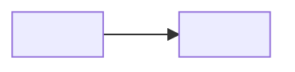

---
tags:
  - tipo/lectura-codigo
  - proyecto/vaecos-tracking
fecha: 2026-05-11
pasada:
estado: en-progreso
---
# Lectura: Sin título

## Objetivo de la lectura

^c5d54f

Qué flujo/módulo/archivo voy a entender y por qué.

## Pre-lectura

- [ ] README
- [ ] Docs relevantes (architecture, design, prd)
- [ ] Tests del módulo

## Mapa de archivos involucrados

| Archivo | Rol |
|---|---|
| ... | ... |

## Diagrama del flujo

O en bullets:
- Entra por...
- Llama a...
- Devuelve...

## Resumen en lenguaje natural

Explicación del flujo como si se lo contara a otro humano.

## Patrones identificados

- **Pattern X**: dónde y por qué
- **Pattern Y**: dónde y por qué

## Dudas honestas

- [ ] ¿Por qué se decidió X y no Y?
- [ ] No entiendo qué hace la función Z.
- [ ] ¿Esta abstracción era necesaria?

## Próxima pasada / próxima lectura

- [[ ]]
