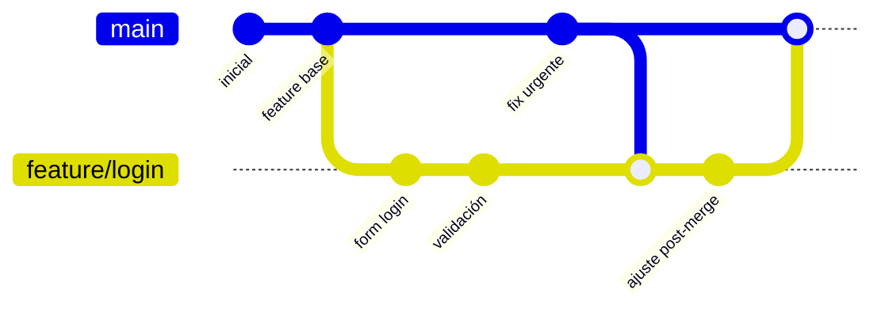

# Git — Conceptos que separan al usuario lineal del colaborador

> Este apunte asume que ya conocés `git add`, `git commit`, `git push`. Va más allá: branches reales, deshacer cambios sin romper, y diferencias críticas entre comandos que parecen iguales.

## Por qué importa

El uso "lineal" de Git (todo en `main`, commits secuenciales) es lo que hace **toda la gente vibecoder**. El uso colaborativo real (branches, PRs, deshacer sin romper a otros) es lo que se usa en cualquier empresa o equipo. Sin esto, no podés contribuir a un proyecto compartido.

---

## 1. Branches — qué son y CÓMO usarlas

### El concepto

Una **branch** (rama) es una línea independiente de desarrollo. Empieza desde un punto del historial y diverge. Te permite trabajar en algo nuevo sin tocar `main`.



### Comandos básicos

```bash
# Ver branches existentes
git branch

# Crear branch nueva (sin cambiarte a ella)
git branch feature/login

# Crear y cambiarte en un solo paso (lo más común)
git checkout -b feature/login
# o con sintaxis moderna:
git switch -c feature/login

# Cambiarte a una branch existente
git switch main

# Borrar branch local (cuando ya está mergeada)
git branch -d feature/login

# Borrar branch local FORZADO (cuidado, perdés trabajo no mergeado)
git branch -D feature/login
```

### Convenciones de nombres (cualquier equipo serio las usa)

- `feature/<algo>` — funcionalidad nueva
- `fix/<algo>` — bugfix
- `hotfix/<algo>` — fix urgente en producción
- `refactor/<algo>` — refactor sin cambio de comportamiento
- `docs/<algo>` — solo documentación
- `chore/<algo>` — tareas de mantenimiento

### Flujo típico

```bash
# 1. Asegurate de partir de un main actualizado
git switch main
git pull

# 2. Creá tu branch
git switch -c feature/agregar-buscador

# 3. Trabajá: cambiá archivos, commiteá
git add .
git commit -m "feat: agregar input de búsqueda"

# 4. Subí la branch al remoto
git push -u origin feature/agregar-buscador

# 5. Abrí un Pull Request en GitHub (manualmente o con `gh pr create`)

# 6. Después de mergear el PR, limpiá local
git switch main
git pull
git branch -d feature/agregar-buscador
```

---

## 2. Deshacer cambios — los 3 caminos peligrosos

Esta es la parte donde más se rompe gente. Los 3 comandos parecen iguales y NO lo son.

### Tabla de decisión

| Situación | Comando correcto | Por qué |
|---|---|---|
| Quiero modificar el último commit (mensaje o archivos), aún NO pusheado | `git commit --amend` | Reemplaza el último commit por uno nuevo. Solo seguro EN LOCAL. |
| Quiero deshacer commits que NO pusheé | `git reset --soft HEAD~1` (mantiene cambios) o `git reset --hard HEAD~1` (los borra) | Reescribe historial local. |
| Quiero deshacer un commit que YA pusheé | `git revert <commit>` | Crea un commit NUEVO que deshace los cambios. Historial intacto. |

### `git revert` — el SEGURO

Crea un commit que aplica los cambios opuestos al commit que querés deshacer. **No reescribe historial**, por eso es seguro en código compartido.

```bash
git revert abc123
# Te abre el editor para confirmar el mensaje del commit nuevo
git push
```

Resultado en el historial:
```
abc123  feat: agregar buscador        ← el "malo"
def456  Revert "feat: agregar buscador"  ← lo deshace, pero queda registrado
```

### `git reset` — el PELIGROSO

Mueve el puntero `HEAD` hacia atrás, **borrando** commits del historial local.

```bash
git reset --soft HEAD~1   # vuelve 1 commit, mantiene cambios staged
git reset --mixed HEAD~1  # vuelve 1 commit, cambios sin stagear (default)
git reset --hard HEAD~1   # vuelve 1 commit, BORRA cambios — irreversible si no hay copia
```

**Por qué es peligroso después de pushear:** si hacés `reset` + `push --force`, borrás commits del remoto. Si tu equipo tenía esos commits, los pierden.

> Regla de oro: **`reset` solo en local, `revert` en lo que ya compartiste**.

### `git commit --amend` — para arreglar el último

```bash
# Cambiar solo el mensaje del último commit
git commit --amend -m "nuevo mensaje"

# Agregar archivos olvidados al último commit
git add archivo-olvidado.py
git commit --amend --no-edit
```

Solo seguro **antes** de `git push`. Si ya pusheaste y hacés amend, tenés que `push --force` y romper a quien ya bajó esos commits.

---

## 3. `.gitignore` — qué NO sube

Archivo en la raíz del repo que lista patrones de archivos/carpetas que Git debe ignorar.

```gitignore
# Entornos virtuales de Python
.venv/
venv/

# Variables de entorno y secretos
.env
*.env.local

# Cachés de Python
__pycache__/
*.pyc

# Notebooks: outputs y checkpoints
.ipynb_checkpoints/

# Editor / IDE
.vscode/
.idea/

# Sistema
.DS_Store
Thumbs.db

# Build artifacts
dist/
build/
*.egg-info/
```

> Si ya commiteaste algo que debió ignorarse, agregarlo al `.gitignore` NO lo borra. Tenés que removerlo del tracking:
> ```bash
> git rm --cached archivo-secreto.env
> git commit -m "chore: dejar de trackear .env"
> ```

---

## 4. Pull Request (PR) — qué es y por qué existe

Un **Pull Request** es una propuesta de mergear una branch a otra (típicamente tu branch a `main`). Vive en GitHub/GitLab/Bitbucket, no en Git mismo.

Sirve para:
- **Revisión:** otra persona ve tus cambios antes de mergear.
- **Discusión:** comentarios línea por línea.
- **Validación automática:** CI corre tests, linters, builds.
- **Historial documentado:** queda registro de qué cambió, por qué y quién lo aprobó.

Crear uno por línea de comando con GitHub CLI:

```bash
gh pr create --title "feat: agregar buscador" --body "Descripción del cambio"
```

---

## Errores comunes / gotchas

- **Trabajar siempre en `main`.** Si todo lo hacés en main, no podés revertir cambios sin romper la línea principal. Branches son obligatorias en cualquier equipo.
- **`git push --force` en `main` o branches compartidas.** Casi nunca tiene justificación. Si lo necesitás, usá `--force-with-lease` que al menos chequea que no estás pisando trabajo de otros.
- **Mergear sin pull primero.** Si tu branch quedó atrás de main, mergeás sobre código viejo y generás conflictos innecesarios. Antes de PR: `git switch main && git pull && git switch tu-branch && git merge main`.
- **Commits gigantes "wip" cada 3 días.** Commits chicos y temáticos = historial leíble. Convención común: tipo + descripción corta (`feat:`, `fix:`, `docs:`, `refactor:`, `chore:`, `test:`).

## Notas relacionadas

- [[../python/apuntes/venv-vs-env]] — qué excluir del repo y por qué
- [[markdown-y-obsidian]] — para escribir buenos READMEs en repos

## Fuentes

- Pro Git book (gratis): https://git-scm.com/book/en/v2
- Conventional Commits: https://www.conventionalcommits.org
