# Mermaid — Diagramas en markdown

> Mermaid permite dibujar diagramas escribiendo texto. Obsidian los renderiza solo. Para documentar flujos de código, arquitecturas y bases de datos sin tener que abrir herramientas externas.

> [!info] Conceptos detrás de los diagramas
> Esta guía cubre la **sintaxis** de Mermaid. Para entender los **conceptos** que estás dibujando:
> - **Class diagrams** → ver [[conceptos-poo]] (clases, herencia, composición, protocolos)
> - **ER diagrams** → ver [[conceptos-bd]] (tablas, PK, FK, cardinalidad, normalización)

---

## Cómo se escribe un diagrama

Dentro de tu nota, abres un bloque de código con `mermaid` como lenguaje:

````markdown
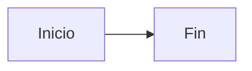
````

Obsidian lo renderiza automáticamente en modo lectura.

---

## 1. Flowchart (graph) — el que MÁS vas a usar

Para flujos de código, decisiones, procesos.

### Dirección

| Sintaxis | Significado |
|---|---|
| `graph TD` o `graph TB` | Top-Down (de arriba a abajo) |
| `graph BT` | Bottom-Top |
| `graph LR` | Left-Right (de izquierda a derecha) |
| `graph RL` | Right-Left |

> **Tip:** `LR` suele leerse mejor en monitores anchos. `TD` mejor para flujos largos o decisiones tipo árbol.

### Formas de nodos

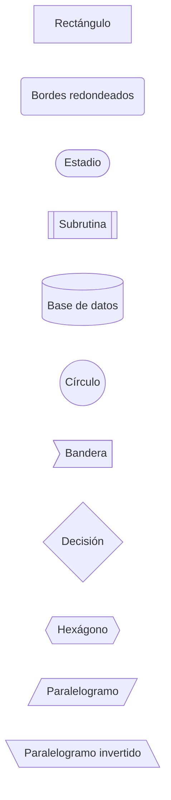

**Significados convencionales:**
- `[ ]` → proceso/acción
- `( )` → estado/dato
- `{ }` → decisión (if/else)
- `[( )]` → base de datos
- `(( ))` → inicio/fin
- `[[ ]]` → módulo o función externa

### Conexiones (flechas)

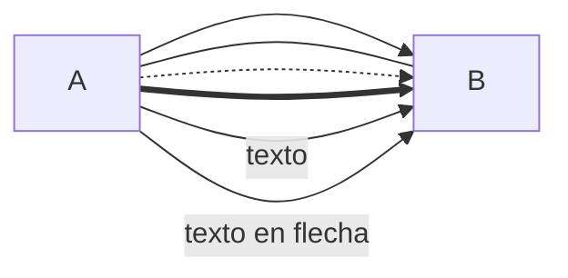

| Sintaxis | Significado |
|---|---|
| `-->` | Flecha sólida |
| `---` | Línea sin flecha |
| `-.->` | Flecha punteada |
| `==>` | Flecha gruesa |
| `-- texto -->` | Flecha con texto |

### Ejemplo realista — flujo de `/attention` en vaecos

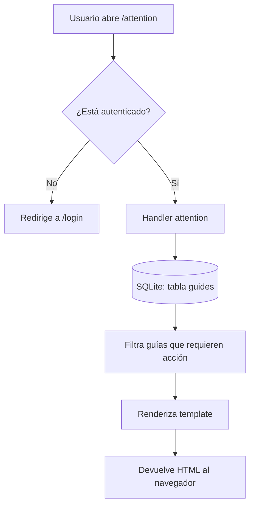

### Subgrafos (para agrupar)

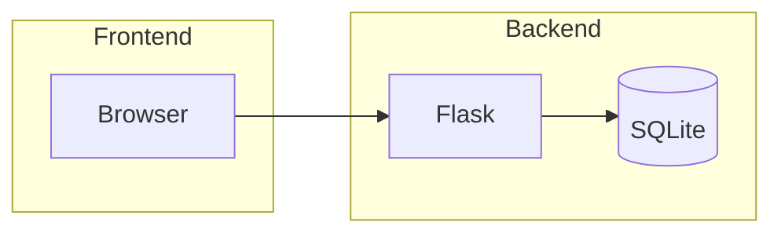

Útil para mostrar capas o módulos juntos.

---

## 2. Sequence diagram — para interacciones

Cuando quieres mostrar QUIÉN llama a QUIÉN en qué orden. Perfecto para documentar APIs, autenticación, llamadas entre módulos.

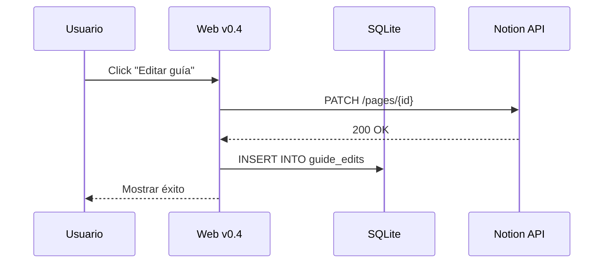

**Tipos de flechas:**
- `->>` → llamada normal
- `-->>` → respuesta (línea punteada)
- `-x` → llamada que falla
- `->>+` y `-->>-` → activar/desactivar barra de actividad

### Ejemplo realista — patrón atómico Notion FIRST

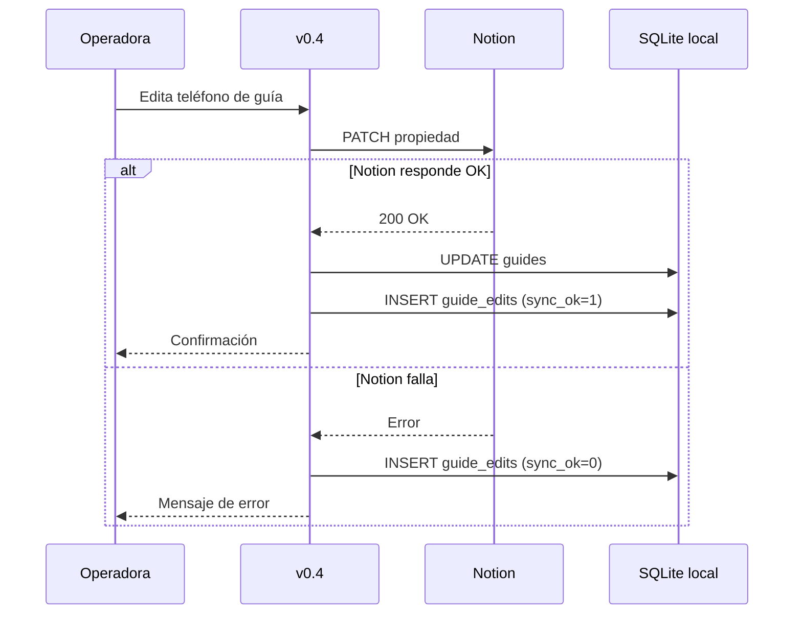

`alt / else / end` te permite mostrar caminos alternativos.

---

## 3. Class diagram — para POO

Cuando documentes clases, herencia, protocolos. Útil para entender el `Carrier Protocol` de vaecos.

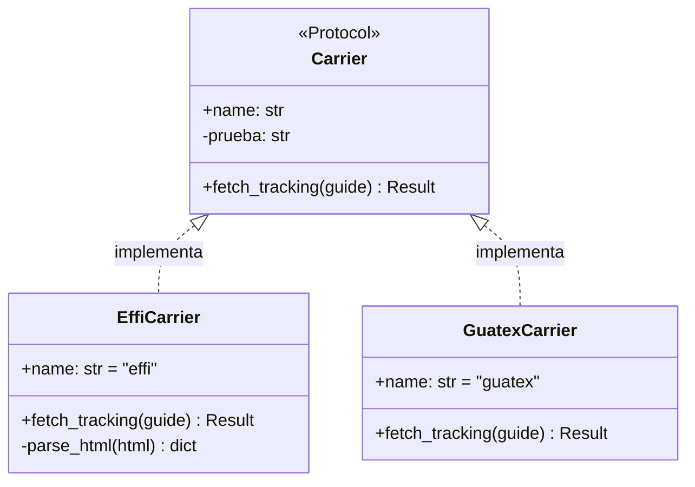

**Relaciones:**
- `<|--` → herencia (extiende)
- `<|..` → implementación (Protocol/Interface)
- `*--` → composición
- `o--` → agregación
- `-->` → asociación

**Visibilidad:**
- `+` público
- `-` privado
- `#` protegido

---

## 4. ER diagram — para bases de datos

Cuando documentes el esquema de SQLite o cualquier BD. Útil para entender la estructura de `vaecos_tracking.db`.

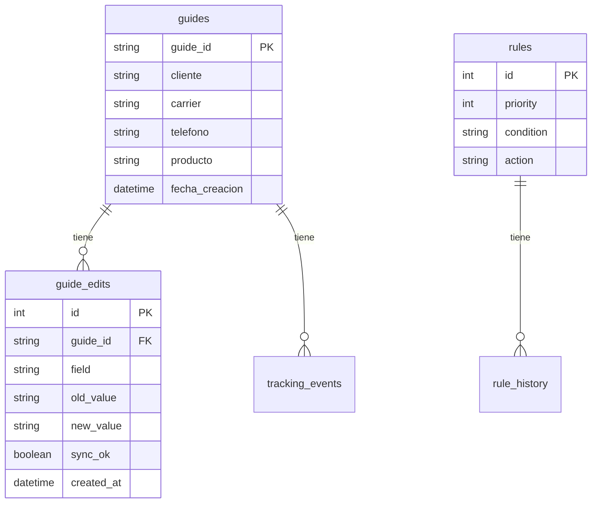

**Cardinalidades:**
- `||--||` → uno a uno
- `||--o{` → uno a muchos
- `}o--o{` → muchos a muchos

---

## 5. Mindmap — para mapas mentales

Cuando estudies un concepto grande y quieras un panorama.

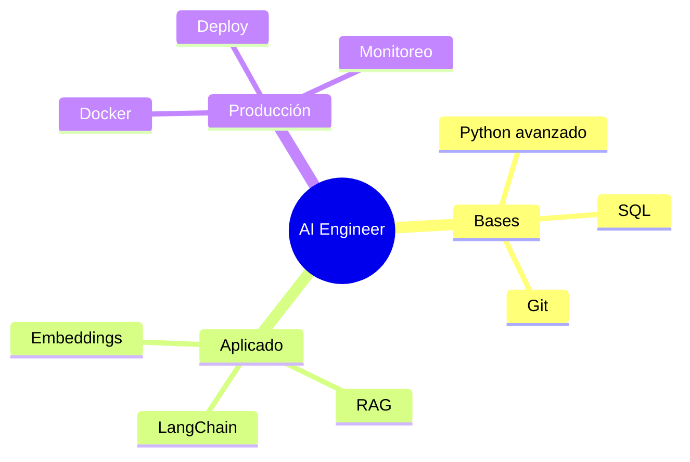

---

## 6. Timeline — para líneas de tiempo

Útil para roadmaps, planes de aprendizaje, evolución de un proyecto.

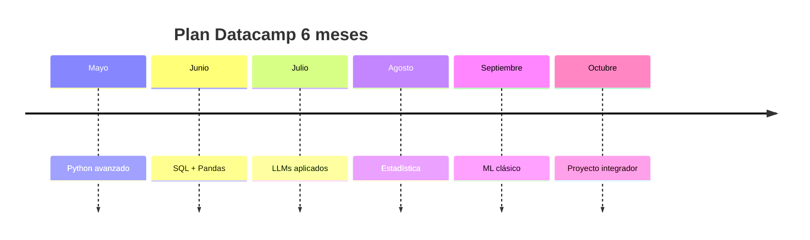

---

## Tips para diagramas que se leen bien

1. **No metas más de 7-10 nodos en un solo diagrama.** Si necesitas más, divide en varios o usa `subgraph`.
2. **Usa texto corto en los nodos.** "Validar usuario" es mejor que "Función que valida que el usuario haya iniciado sesión correctamente".
3. **Sé consistente con las formas.** Si los procesos son rectángulos, todos los procesos son rectángulos.
4. **Una dirección, no mezcles.** `LR` o `TD`, no cambies a mitad del flujo.
5. **Comenta líneas complejas.** Mermaid acepta `%% esto es un comentario`.
6. **Si una flecha cruza muchas otras**, mueve nodos o usa subgrafos.

---

## Errores comunes

- ❌ Olvidar la línea en blanco después del bloque ` ```mermaid ` o antes del cierre.
- ❌ Usar caracteres especiales sin escapar: `(`, `)`, `"`, `:` dentro del texto de un nodo rompen el parser.
  - **Solución:** envuelve el texto en comillas: `A["Texto con (paréntesis)"]`
- ❌ Mezclar direcciones (`graph TD` arriba y luego flechas que van en LR).
- ❌ Olvidar declarar el tipo de diagrama en la primera línea (`graph`, `sequenceDiagram`, etc.).

---

## Trucos rápidos en Obsidian

- Para previsualizar mientras editas: `Ctrl + E` alterna entre modo edición y lectura. En modo "Live Preview" se ve renderizado mientras editas.
- Para exportar un diagrama como imagen: clic derecho sobre el diagrama renderizado → "Copy image".
- Si vas a usar muchos diagramas, considera el plugin de comunidad **Mermaid Tools** que da editor visual.

---

## Recursos para aprender más

- [Documentación oficial de Mermaid](https://mermaid.js.org/intro/) — todo, con ejemplos en vivo
- [Live editor de Mermaid](https://mermaid.live/) — pruebas sintaxis en tiempo real sin abrir Obsidian
- Cheat sheet imprimible: buscar "mermaid cheatsheet" en GitHub, hay varios

---

*Apunte vivo. Agrega más tipos de diagrama si los encuentras útiles.*
