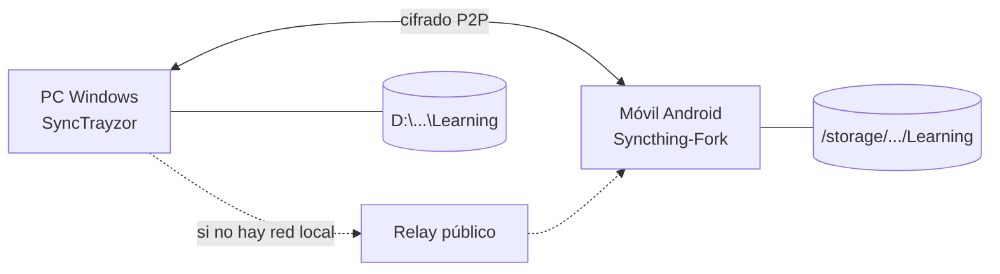

# Sincronizar Obsidian entre PC (Windows) y Android con Syncthing

> Sync peer-to-peer, gratis, sin nube. Tu PC y tu móvil hablan directo entre sí cuando están conectados. Ideal para Obsidian.

---

## Conceptos rápidos antes de empezar

- **Syncthing** funciona **emparejando dispositivos**. Cada dispositivo tiene un **ID único** (un código largo) y se conectan mutuamente cuando lo escanean/comparten.
- Cada **carpeta compartida** se identifica con un **Folder ID**. Las dos puntas tienen que aceptar la misma carpeta para que sincronice.
- Es **bidireccional por defecto**: cambias en PC → llega al móvil. Cambias en móvil → llega al PC.
- Si están en la misma red WiFi, sincroniza directo y rápido. Si están en redes distintas, usa **servidores relay** públicos (más lento, pero funciona en cualquier parte del mundo).

---

## Parte 1 — Instalación en Windows

### 1.1 Descargar Syncthing

Ve a [syncthing.net/downloads](https://syncthing.net/downloads/) y descarga la versión Windows (64-bit).

> Hay dos formas de correrlo en Windows:
> - **Syncthing simple** (un .exe que abre una terminal cuando lo ejecutas — funcional pero feo)
> - **SyncTrayzor** (interfaz gráfica + bandeja del sistema — **recomendado**)

### 1.2 Instalar SyncTrayzor (recomendado)

1. Ve a [SyncTrayzor releases en GitHub](https://github.com/canton7/SyncTrayzor/releases)
2. Descarga el `.exe` o `.msi` más reciente
3. Instala normal
4. Al abrirlo, Syncthing arranca automáticamente y aparece un ícono en la bandeja del sistema (al lado del reloj)
5. Clic derecho en el ícono → "Open SyncTrayzor" abre la interfaz web local

### 1.3 Verificar que funciona

- La interfaz se abre en `http://127.0.0.1:8384`
- Deberías ver tu **Device ID** en la parte superior derecha (clic en "Actions" → "Show ID")

---

## Parte 2 — Instalación en Android

### 2.1 Descargar Syncthing-Fork

Es la app **mantenida activamente** en 2026 (la oficial original fue descontinuada).

**Tres formas de instalarla, en orden de preferencia:**

1. **F-Droid (recomendado, software libre)**: instala F-Droid desde [f-droid.org](https://f-droid.org/), abre F-Droid, busca "Syncthing-Fork" e instala
2. **Google Play Store**: busca "Syncthing-Fork" (el desarrollador es Catfriend1)
3. **APK directo**: desde [GitHub releases](https://github.com/Catfriend1/syncthing-android/releases)

### 2.2 Configuración inicial en Android

Al abrir Syncthing-Fork por primera vez:

1. **Da los permisos que pide**:
   - Acceso a almacenamiento (obligatorio)
   - Notificaciones (recomendado para ver progreso)
   - Ignorar optimización de batería (**MUY IMPORTANTE** — sin esto, Android mata el proceso y deja de sincronizar)

2. Acepta los términos y deja que arranque el daemon

3. Verifica que esté corriendo: en la pestaña "Estado" debería decir "En ejecución"

---

## Parte 3 — Emparejar los dos dispositivos

### 3.1 Obtener el Device ID del PC

En SyncTrayzor (Windows):
- Clic en "Actions" arriba a la derecha → "Show ID"
- Verás un QR code y un código largo tipo `ABCDEF7-XYZ1234-...`

### 3.2 Añadir el PC al móvil

En Syncthing-Fork (Android):
- Pestaña **"Dispositivos"** → botón **+** abajo a la derecha
- **Escanea el QR code** del PC con la cámara (la opción más rápida)
- Acepta los valores por defecto y guarda

### 3.3 Confirmar desde el PC

Al añadirlo en el móvil, el PC va a mostrar una **notificación** preguntando "¿Quieres aceptar este dispositivo?"
- Acepta
- Dale un nombre amigable (ej: "Móvil Ruben")

Ahora los dos dispositivos se reconocen mutuamente.

---

## Parte 4 — Compartir la carpeta `Learning`

### 4.1 Añadir la carpeta en el PC

En SyncTrayzor:
1. Pestaña **"Folders"** → **"Add Folder"**
2. **Folder Path**: `D:\Mis Archivos\Documentos\Learning`
3. **Folder Label**: `Learning` (cualquier nombre amigable)
4. **Folder ID**: lo genera automáticamente (puedes editarlo si quieres, pero no es necesario)
5. Pestaña **"Sharing"** dentro del diálogo: marca el dispositivo "Móvil Ruben"
6. Pestaña **"Advanced"**: deja "Folder Type" en **"Send & Receive"** (sincronización bidireccional)
7. Guarda

### 4.2 Aceptar la carpeta en el móvil

El móvil va a mostrar notificación: "El PC quiere compartir contigo la carpeta Learning":
1. Toca la notificación
2. **Folder Path**: aquí eliges DÓNDE se va a guardar en tu móvil. Recomendado:
   - `/storage/emulated/0/Obsidian/Learning` (carpeta accesible desde Obsidian móvil)
   - O en Android 11+: `/storage/emulated/0/Documents/Obsidian/Learning`
3. **Folder Type**: "Send & Receive"
4. Guarda

Empieza a sincronizar. Verás el progreso en barra.

> **Primera sincronización puede tardar varios minutos** dependiendo del tamaño del vault. Espera a que termine antes de tocar nada en cualquiera de los dos lados.

---

## Parte 5 — Configurar Obsidian en el móvil

### 5.1 Instalar Obsidian para Android

Desde Google Play: "Obsidian".

### 5.2 Abrir el vault sincronizado

1. Abre Obsidian Android
2. Selecciona **"Open folder as vault"**
3. Navega a la carpeta donde Syncthing guardó `Learning` (ej: `/storage/emulated/0/Obsidian/Learning`)
4. Confirma y dale acceso

¡Listo! Ahora cualquier nota que escribas en móvil va a aparecer en PC y viceversa.

---

## Parte 6 — Configurar `.stignore` para evitar problemas

Hay archivos de Obsidian que **NO deberías sincronizar** porque generan conflictos (workspace, cache, etc.). Crea un archivo `.stignore` en la raíz del vault.

### 6.1 Crear el archivo

En PC, crea `D:\Mis Archivos\Documentos\Learning\.stignore` con este contenido:

```
# Cache y estado local de Obsidian
.obsidian/workspace
.obsidian/workspace.json
.obsidian/workspace-mobile.json
.obsidian/workspaces.json

# Cache de plugins
.obsidian/cache

# Trash de Obsidian
.trash

# Archivos del sistema
.DS_Store
Thumbs.db
desktop.ini

# Archivos temporales
*.tmp
*~
```

Guarda y Syncthing aplicará las reglas automáticamente.

### 6.2 ¿Por qué excluir esto?

- `workspace*` — guarda qué paneles tienes abiertos en cada dispositivo. Si sincronizas, el móvil intenta abrir paneles del PC y se rompe la vista.
- `cache` — son archivos generados que no necesitas sincronizar.
- `.trash` — la papelera local, no tiene sentido sincronizar la papelera.

---

## Parte 7 — Resolver problemas comunes

### "No se sincroniza"

1. Verifica que ambos dispositivos estén **encendidos y con Syncthing corriendo**.
2. Si están en redes distintas, verifica que ambos tengan internet.
3. En Android: revisa que **no esté en modo ahorro de batería estricto** para Syncthing-Fork.
4. En PC: verifica que SyncTrayzor no esté pausado (ícono en bandeja).

### "Conflicto: archivo.sync-conflict-..."

Pasa cuando editaste la misma nota en los dos lados sin sincronizar entre medias. Solución:

1. Abre los dos archivos
2. Compara los cambios
3. Combina manualmente
4. Borra el archivo `.sync-conflict-...`

**Para prevenir:** asegúrate de que el sync termine antes de empezar a editar.

### "Android mata el proceso después de un rato"

Es la pelea eterna con Android. Soluciones:

1. **Opciones → Comportamiento → Ignorar optimización de batería** dentro de Syncthing-Fork
2. **Ajustes del sistema → Apps → Syncthing-Fork → Batería → Sin restricción**
3. Algunos fabricantes (Xiaomi, Huawei, Oppo) tienen pasos extras — busca "syncthing [marca de tu móvil] battery" si sigue fallando.

### "Cómo verifico que está sincronizando"

En cualquier lado:
- Si dice **"Hasta la fecha" / "Up to date"** en verde, todo bien.
- Si dice **"Sincronizando X%"**, está trabajando.
- Si dice **"Sin conexión"**, el otro dispositivo no es alcanzable.

---

## Bonus — Buenas prácticas para vault sincronizado

1. **No edites la misma nota simultáneamente** en PC y móvil. Si vas a usar móvil un rato, cierra Obsidian en PC o termina lo que estabas haciendo.
2. **Cambios grandes hazlos siempre en PC.** Renombrar muchas carpetas, importar muchos archivos, etc. El móvil es para notas rápidas y consulta.
3. **El primer sync de un vault grande tarda.** Ten paciencia, no canceles a la mitad.
4. **Cuando viajes**, verifica que el sync esté al día antes de salir. Si el móvil queda atrás, puede crear conflictos.

---

## Resumen visual del flujo



---

## Recursos

- [Documentación oficial Syncthing](https://docs.syncthing.net/)
- [Syncthing-Fork en F-Droid](https://f-droid.org/packages/com.github.catfriend1.syncthingandroid/)
- [SyncTrayzor en GitHub](https://github.com/canton7/SyncTrayzor)
- [Foro de la comunidad Syncthing](https://forum.syncthing.net/)

---

*Apunte vivo. Cuando descubras una optimización, agrégala aquí.*
